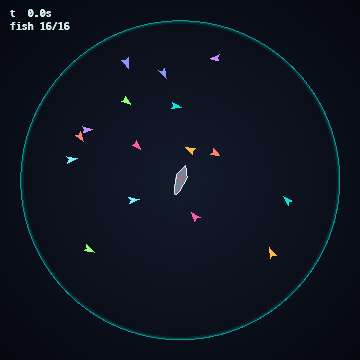

<div align="center">

# 🌊 Deep Ocean

**Learn to escape the shark — a top-down reinforcement-learning arena.**

A single fish learns to evade a relentless, pursuing shark inside a circular
arena. Because the policy is trained purely *egocentrically* (everything it sees
is relative to itself), the exact same brain then drives a whole **swarm** — each
fish reacting to the shark from its own point of view.

[](https://github.com/yferc/predators/actions/workflows/ci.yml)




*One PPO brain, shared across the whole school.*

</div>

---

## Why this exists

A compact study in **RL environment design** with a twist that makes it look
great: train one agent, deploy many. The environment is fast (pure-NumPy
point-mass physics), the reward is simple and honest (survive, keep your
distance, don't hug the wall), and the renderer is built for a clean, neon,
top-down aesthetic.

## Features

- 🎮 **Clean Gymnasium API** — passes `gymnasium.utils.env_checker`, drops straight into Stable-Baselines3.
- 🦈 **A smart, pursuing shark** — steers toward its prey each step, capped just below fish top speed so evasion is genuinely possible (and genuinely hard).
- 🧠 **Egocentric policy → emergent swarm** — trained on one fish, rendered as a whole school sharing the same brain.
- 🎨 **Stylish top-down renderer** — glowing circular arena, radial-gradient sea, fish as arrowheads with fading trails.
- ✅ **Tested & linted** — behaviour tests (task-is-learnable, shark-catches-idle-fish) and CI on Python 3.10–3.12.

## How it works

### The arena
A unit circle. Fish and shark are damped point masses; the wall reflects them.

### The shark
Each step the shark accelerates toward its target (in the swarm demo, the
nearest living fish), capped at `SHARK_MAX_SPEED` — deliberately a touch slower
than the fish, so a clever fish can escape but a careless one is lunch.

### Observation — `Box(shape=(9,))`
Everything relative to the fish: shark position (2), shark velocity (2), own
velocity (2), own radial position (2, i.e. how close to the wall), and shark
distance (1). This egocentric framing is what lets one policy generalise to a
whole swarm.

### Action — `Box(shape=(2,), [-1, 1])`
A 2-D acceleration command.

### Reward
```
+ survive            small reward each step
+ keep distance      scaled by distance to the shark
- hug the wall       penalty for cowering on the boundary
- caught             large penalty, episode ends
```

## Quickstart

```bash
git clone https://github.com/yferc/predators.git
cd predators
pip install -e ".[train,media]"

python scripts/train.py --timesteps 800000       # train the evasion policy
python scripts/record.py --model models/best/best_model.zip --out docs/media/demo
```

Watch a single fish live:

```python
import gymnasium as gym, deepocean
from stable_baselines3 import PPO

env = gym.make("DeepOcean-v0", render_mode="human")
model = PPO.load("models/best/best_model.zip")
obs, _ = env.reset()
done = False
while not done:
    action, _ = model.predict(obs, deterministic=True)
    obs, r, term, trunc, _ = env.step(action)
    env.render(); done = term or trunc
```

## Results

PPO trained for **800k timesteps** (8 parallel envs, a few minutes on CPU), then
evaluated with a **deterministic** policy over **30 fresh episodes**:

| Metric | Value |
| --- | --- |
| Mean survival | **600 / 600 steps (30.0 s)** |
| Full-episode escapes | **30 / 30 (100%)** |

A single trained fish evades the shark indefinitely. In the swarm demo above,
one copy of that policy drives every fish (with a touch of per-fish noise so the
school spreads out rather than stacking), and the shark hunts the nearest — so
some fish do get caught, which is what makes it fun to watch.

## Project structure

```
predators/
├── deepocean/
│   ├── env.py        # DeepOcean-v0 — the Gymnasium environment
│   ├── dynamics.py   # shared point-mass physics + shark pursuit
│   └── render.py     # stylish top-down neon renderer
├── scripts/
│   ├── train.py      # PPO training
│   └── record.py     # swarm demo → GIF + MP4
├── tests/
└── .github/workflows/ci.yml
```

## Testing

```bash
pip install -e ".[dev]"
pytest -q
```

## License

MIT — see [LICENSE](LICENSE).
