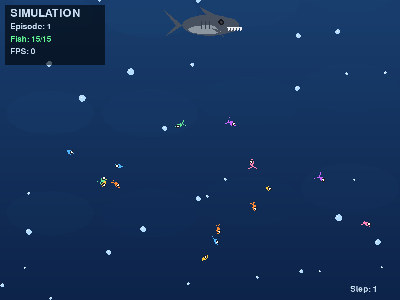

# 🦈 Deep Ocean - Fish vs Shark AI Simulation

A stunning 2D simulation where fish learn to escape from a sweeping shark using **Deep Reinforcement Learning**.

<p align="center">
  
</p>


## 🎮 Overview

Watch as AI-controlled fish develop survival instincts through learning:

- **🦈 One Big Shark** - Sweeps horizontally across the ocean, unstoppable predator
- **🐟 School of Fish** - Share a neural network, learn to escape together  
- **👁️ Raycast Vision** - Fish "see" the shark and walls through 24 directional rays
- **🧠 PPO Algorithm** - State-of-the-art Deep RL for learning escape strategies

## ✨ Features

- **Beautiful Pygame Visualization**
  - Animated shark with realistic movement
  - Colorful fish with trailing effects
  - Underwater caustics and bubbles
  - Particle effects on fish death

- **Deep Reinforcement Learning**
  - Shared policy network (all fish use same "brain")
  - Raycast-based observations (24 rays detecting shark/walls)
  - PPO (Proximal Policy Optimization) training
  - PyTorch implementation

## 🚀 Quick Start

### Installation

```bash
# Clone repo
git clone https://github.com/yferc/predators.git
cd predators

# Install dependencies
pip install -r requirements.txt
```

### Watch Random Agents (No Training)

```bash
python watch_random.py
```

See untrained fish swimming randomly - they'll get eaten quickly!

### Train the Fish

```bash
python train.py
```

Watch fish learn to escape over time.

### Record Video

```bash
python watch_random.py --record
```

## 🎯 How It Works

### Environment
- **Ocean**: 800×600 pixel continuous space
- **Shark**: Sweeps horizontally, moves up after each pass
- **Fish**: 15 fish, each with raycast vision

### Observation Space (per fish)
| Component | Size | Description |
|-----------|------|-------------|
| Shark rays | 24 | Distance to shark in each direction |
| Wall rays | 24 | Distance to walls in each direction |
| Shark direction | 2 | Relative x, y to shark |
| Shark distance | 1 | Normalized distance |
| Velocity | 2 | Current fish velocity |
| **Total** | **53** | |

### Action Space
- Continuous 2D: `(dx, dy)` acceleration in range `[-1, 1]`

### Rewards
| Event | Reward |
|-------|--------|
| Survival (per step) | +0.1 |
| Distance from shark | +0.05 (if far) |
| Getting eaten | -10.0 |

## 📁 Project Structure

```
predators/
├── environment.py      # Gym-compatible ocean environment
├── visualization.py    # Pygame renderer with effects
├── train.py           # PPO training implementation
├── watch_random.py    # Demo with random agents
├── requirements.txt   # Dependencies
└── README.md
```

## 🎬 Creating Content

The visualization is designed to be **visually engaging** for social media:

1. Run `python watch_random.py --record` to capture footage
2. The underwater effects, colorful fish, and dramatic shark create eye-catching content
3. Perfect for Instagram Reels, YouTube Shorts, TikTok

## 🛠️ Configuration

Edit parameters in `environment.py`:

```python
OceanEnvironment(
    width=800,          # Ocean width
    height=600,         # Ocean height
    num_fish=15,        # Number of fish
    num_rays=24,        # Raycast resolution
    shark_speed=2.0,    # Shark movement speed
    fish_speed=4.0,     # Max fish speed
)
```

## 📈 Training Progress

After training, you should see:
- **Early**: Fish swim randomly, most get eaten
- **Mid**: Fish start avoiding shark's path
- **Late**: Fish develop coordinated escape strategies

## 📝 License

MIT License - Use freely for learning and portfolio!

---

*Built with 🐟 PyTorch + Pygame for AI portfolio demonstration*
